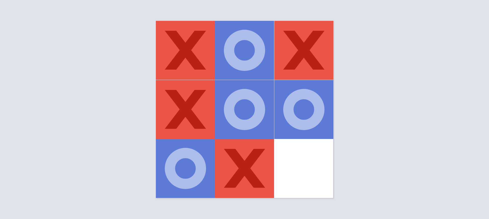

# Odin Tic Tac Toe

## About
This project features the iconic Tic Tac Toe game implemented using the module pattern in vanilla Javascript.
It features:
- An animated 3 x 3 board where the game is played.
- Hover and focus states for all elements.
- An optional form for choosing the names of the players.
- Naturally responsive design (no media queries).
- An end screen announcing the winner and prompting the players to start a new round.
- Players can change their in-game names or keep them the same between rounds.
## What I learned
Most of the code resides inside the two modules `Board` and `Game`:
```js
const Board = (function () {
  /* ... */
})();

const Game = (function () {
  /* ... */
})();
```
The `Board` module handles the interactions between the player and the grid and modifies how each cell in the grid is displayed.
The `Game` module keeps track of the player data and the round number, stops the game when it is finished and determines the winner.

This is the code that determines the winner:
```js
const checkWinnerMarker = () => {
  let result = '';
  [[0, 1, 2], [3, 4, 5], [6, 7, 8], [0, 3, 6], [1, 4, 7], [2, 5, 8], [0, 4, 8], [2, 4, 6]].forEach(combination => {
    switch(Board.getMarker([combination[0]]) + Board.getMarker([combination[1]]) + Board.getMarker([combination[2]])) {
      case "XXX":
        result = 'X';
        break;
      case "OOO":
        result = 'O';
        break;
    }
  });
  return result;
}
```
It features a 2D array, where each sub-array stores the indexes for the cells which, if they are all equal, would result in a winner.

The grid uses the `vmin` unit for size so the cells are as large as possible on every device, ensuring its responsiveness.
```css
.grid {
  width: 80vmin;
  height: 80vmin;
  grid-template-rows: repeat(3, 1fr);
  grid-template-columns: repeat(3, 1fr);
  /* ... */
}
```

The content of the marked cells is shown using only CSS background, and the style is different for the two types of markers, which is achieved using the `data-marker` attribute:
```css
&[data-marker="X"] {
  .cell-back {
    background: url("../images/x.svg") no-repeat 50% 50%, var(--red);
    background-size: 70%;
  }
}
&[data-marker="O"] {
  .cell-back {
    background: url("../images/o.svg") no-repeat 50% 50%, var(--blue);
    background-size: 70%;
  }
}
&:not([data-marker]) {
  cursor: pointer;
}
```

[This pen](https://codepen.io/edeesims/pen/wvpYWW) inspired me to implement a 3D spin animation for marked cells:
```html
<div class="cell">
  <div class="cell-content">
    <div class="cell-front"></div>
    <div class="cell-back"></div>
  </div>
</div>
```
```css
.cell {
  position: relative;
  perspective: 500px;
  &[data-marker="X"] {
    .cell-content {
      transform: rotateY(180deg);
    }
  }
  &[data-marker="O"] {
    .cell-content {
      transform: rotateY(180deg);
    }
  }
}

.cell-content {
  position: absolute;
  width: 100%;
  height: 100%;
  transition: transform 500ms;
  transform-style: preserve-3d;
}

.cell-front, .cell-back {
  position: absolute;
  width: 100%;
  height: 100%;
  backface-visibility: hidden;
}

.cell-back {
  transform: rotateY(180deg);
}
```